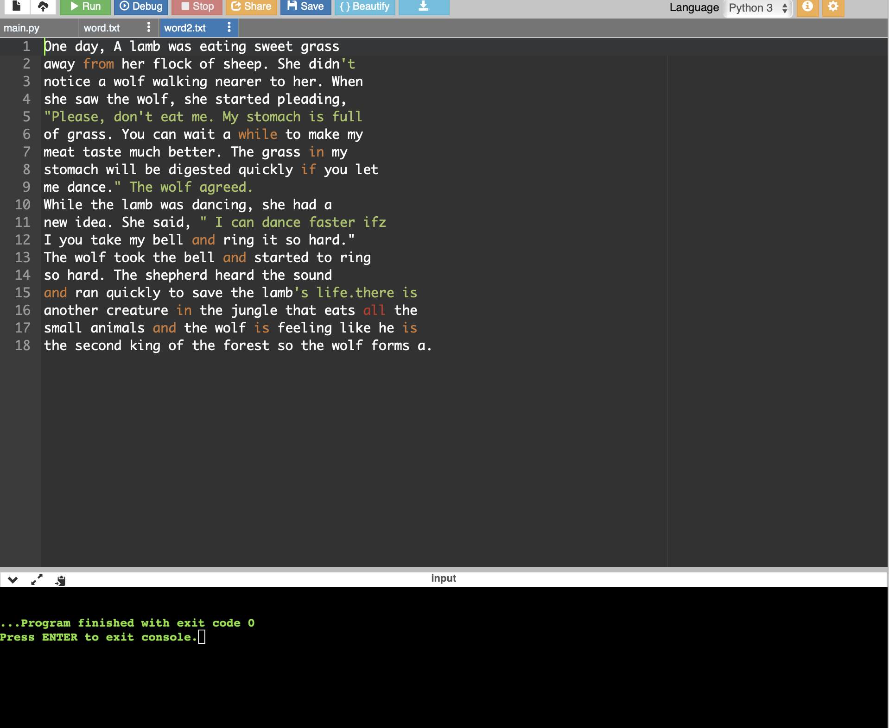

# copy-file
## AIM:
To write a python program for copying the contents from one file to another file.
## EQUIPEMENT'S REQUIRED: 
PC
Anaconda - Python 3.7
## ALGORITHM: 
### Step 1:
create a file and type open
### Step 2: 
 open the second file u want to copy
### Step 3: 
then change the read file and write file

## PROGRAM:
~~~
with open("word.txt") as fp:
    with open("word2.txt","w") as fp1:
        line= fp.read()
        fp1.write(line)
~~~

### OUTPUT:

## RESULT:
Thus the program is written to copy the contents from one file to another file.